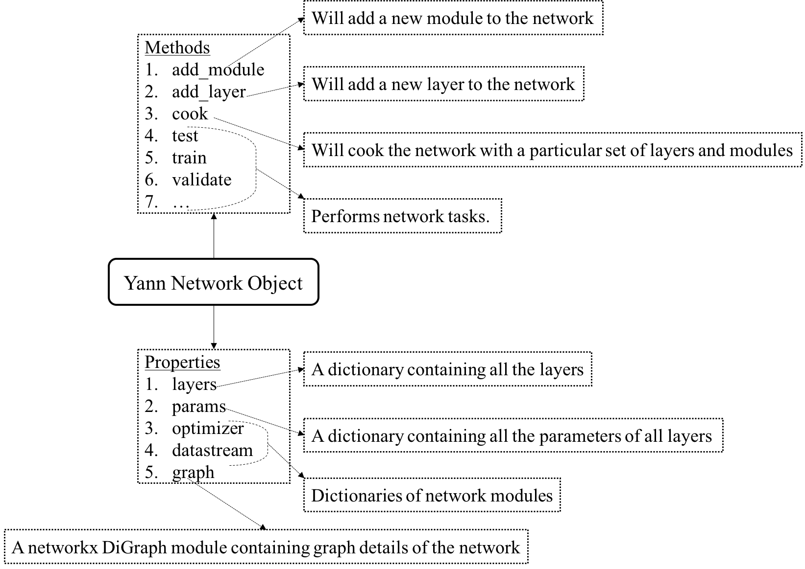
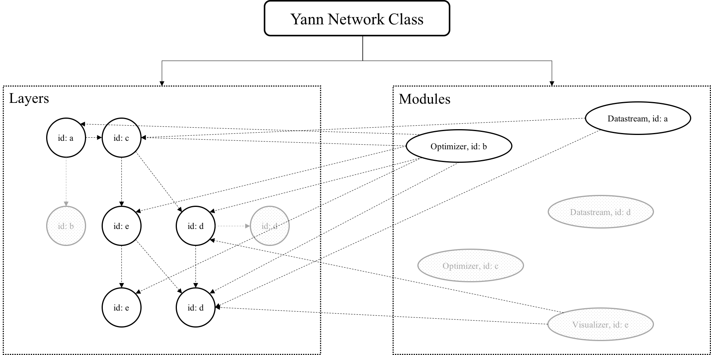

.. _organization:

=============================
Structure of the Yann network
=============================

The core of the yann toolbox and its operations are built around the :mod:`yann.network.network`
class, which is present in the file `yann/network.py`. The above figure shows the organization of 
the :mod:`yann.network.network` class. The :func:`add_xxxx` methods add either a layer or module as 
nomenclature. The network class can hold various layers and modules in various connections and 
architecture that are added using the `add_` methods. While prepping the network for learning, we 
can (or may) need only certain modules and layers. The process of preparing the network by selecting 
and building the training, testing and validation parts of network is called cooking.  

            network.

The above figure shows a cooked network. The objects that are in gray and are shaded are uncooked 
parts of the network. Once cooked, the network is ready for training and testing all by using other 
methods within the network. The network class also has several properties such as layers, which is 
a dictionary of the layers that are added to it and params, which is a dictionary of all the 
parameters. All layers and modules contain a property called `id` through which they are referred.

